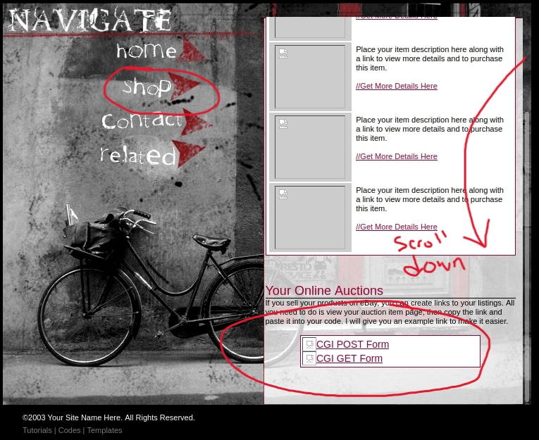

# Lab #1 – HTTP Web Server

```
Test Machine: Windows 11 VirtualBox running Ubuntu 20.04 LTS
```
## Usage

To run my Web Server first ensure you are in the root directory of the project (/webServer) and then run

```
make
```

to build the object files and link everything together. The server can then be started using ./server
followed by the path to the config file. This command is also included in the makefile which can be 
accessed using

```
make run
```
the default port is 9999 so in order to connect via a browser just enter

```
localhost:9999
```

## CGI Usage

Using the included form.htm and form2.htm I directly integrated the forms into the SHOP page at the bottom
of the scrollable pane. A picture below is included for reference in locating the links



## Algorithms

My HTTP 1.0 Web Server is complete with request/response HTML and graphics functionality, concurrency in
the form of threading, CGI Get and Post responsing, logging, and a basic config file for quickly changing
server parameters. In my testing using firefox everything functioned correctly with no issues. I do however 
randomly get some buffer overflows randomly when trying to read from the client which I thought was strange
since I am using a buffer size of 8190 bytes like apache server.. Sometimes I get this issue and sometimes
I do not (hopefully not for you)
